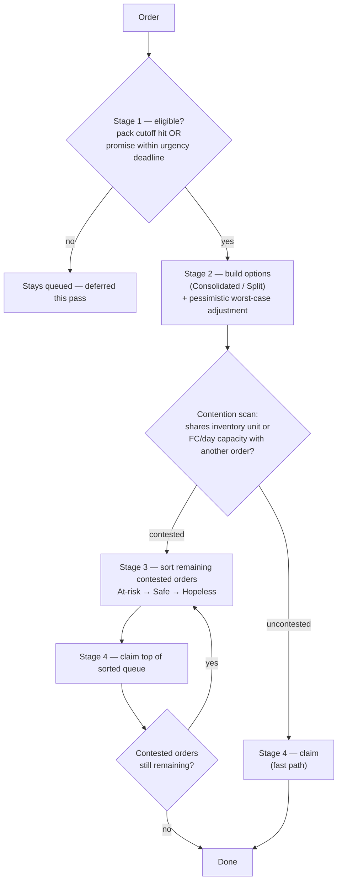
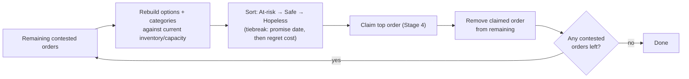
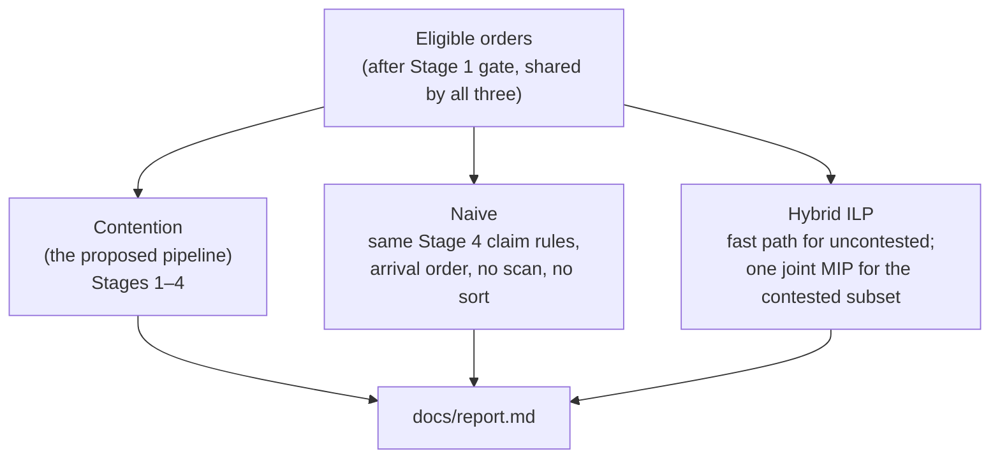
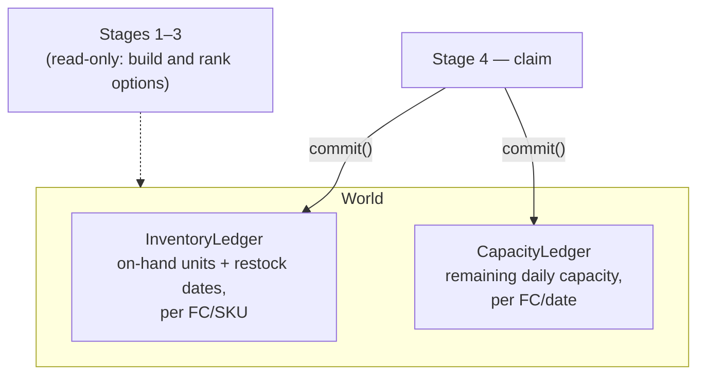
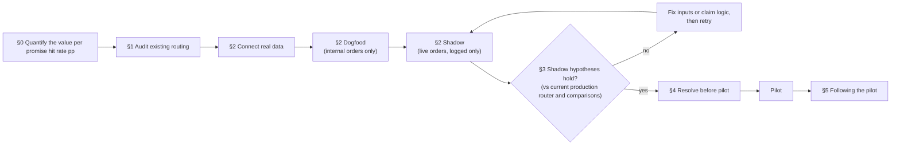

# Order Routing Engine

**Repo:** [github.com/busydbee/order-routing-engine](https://github.com/busydbee/order-routing-engine)

Created: 2026-08-12  
Last updated: 2026-08-13

A working prototype that routes a batch of sample orders to fulfillment centers (FCs). For each order it picks an FC (or a split across FCs), a carrier service level, an estimated delivery date, and a cost. The engine logs every decision in plain language.

Design notes: [`docs/research.md`](docs/research.md).
Batch results: [`docs/report.md`](docs/report.md).

## Quick start

Requires Python 3.9+ (pandas 2.2.3's minimum).

```bash
git clone https://github.com/busydbee/order-routing-engine.git
cd order-routing-engine
python3 -m venv .venv
source .venv/bin/activate
pip install -r requirements.txt
python3 -m pytest -q
python3 run.py
```

`run.py` runs the contention pipeline, a naive arrival-order baseline, and the Hybrid ILP (integer linear program) comparison, then writes `docs/report.md`.

## Repository layout

| Path | Purpose |
|------|---------|
| `data/` | Fabricated FCs, carriers, inventory, and 16 sample orders (14 routing-mechanic orders + 2 exercising Stage 1's eligibility gate) |
| `routing/` | Pipeline stages, cost model, contention scan, baselines, Hybrid ILP (`optimization_ilp.py`) |
| `report/` | Builds `docs/report.md` |
| `tests/` | 81 tests; scenarios in `tests/test_scenario.py` |
| `docs/` | `research.md` (design), `report.md` (generated batch summary) |

## What we optimized for

**Primary: protect the promised delivery date.** When inventory or capacity is scarce, sequence so at-risk promises are less likely to lose their last on-time path.

**Secondary: minimize cost under that constraint.** Cheapest freight among on-time options; if on-time is impossible, lowest effective cost. Cost never overrides an on-time path that still exists. Tradeoffs are in each order's `trade_off` string and in [`docs/report.md`](docs/report.md).

**Why this order:** protecting the promise date over cost pays off through lower support cost, lower churn, or higher checkout conversion. Additional analysis measuring the value of each percentage-point increase in promise hit rate will support guardrails against cost increases. See [§0](#0-quantify-what-a-promise-hit-rate-point-is-worth).

### Success metrics

Go/no-go for pilot and wider rollout. Compare on the same merchant cohort and shipping lanes.

1. **Promise hit rate (shopper EDD)** — % of orders delivered by the checkout date, optionally weighted by order value (**GMV**, gross merchandise value). 
2. **Fulfillment cost per order** — freight + expedite + split extras vs. baseline. May rise to protect a promise only when each material increase maps to a logged date-protection trade-off.
3. **Promise-failure burden** — delivery-related support tickets and chargebacks tied to missed promises, plus escalation volume ops can review.
4. **Merchant retention** — renewal/churn rate for cohort merchants vs. a matched control (§0) for an appropriate measurement window.

Explainability audit and expanding a pilot merchant's volume stay launch gates (§4). Mechanism checks (contention correctness, stockout mitigation, split rate) stay in tests and shadow review as diagnostics.

## How the engine decides

Inventory and FC daily capacity are shared ledgers; each claim updates what is left for later orders. Four stages run over one batch.



**Stage 1 — eligibility** (`routing/stage1_eligibility.py`). Is it decision time yet? An order enters routing the instant *either* a candidate FC has already hit its pack cutoff today, *or* the order's promise date is within its urgency deadline (scaled up by how many zones away the candidate FC is). Otherwise it stays queued.

The report's "Stage 1 — eligibility" table is the real gate. "Stage 1 & 2 — time to promise and feasibility" is display-only (**buffer days** = promise date minus the fastest ETA any FC could hit at batch start, plus Stage 2's **on-time option count**). The gate ignores those numbers.

**Stage 2 — feasibility.** Build options: everything from one FC (**Consolidated**), or each line item from its own best FC (**Split**).

- Drop an FC only if it has no stock and no backorder date. Cutoff and capacity delay ship date (and ETA); Stage 4 keeps late options as its fallback.
- Cost and transit come from fixed carrier tables plus a zone surcharge when FC and customer are more than one zone apart.
- Contested orders then get a **pessimistic worst-case adjustment**: discard an on-time-looking option if it depends on an oversubscribed FC/day and a one-day slip would blow the promise — but only when another on-time option remains. The sequential pipeline never revisits processing order, so this is the safety net against a "safe" option evaporating later. Hybrid ILP skips this: it encodes the same limits as exact constraints, so guessing at slips would double-count risk.

**Contention scan.** If two orders' cheapest options (on-time if either has one, otherwise lowest effective cost) need the same inventory unit or the same FC capacity on the same day, both are **contested**. No overlap → **uncontested**, skip straight to claim.

**Stage 3 — sort contested orders.**

- Categories: **Safe** (2+ on-time options), **At-risk** (exactly one), **Hopeless** (none).
- Process order: At-risk, then Safe, then Hopeless.
- Within a group: earlier promise dates first; ties break on **regret cost** (the cost gap to the next-best option). Safe uses the extra cost of the second-cheapest on-time option; At-risk/Hopeless use the extra cost of the best surviving late fallback.
- Hopeless isn't itself an escalation — Stage 4 decides that from the option actually chosen.

After every claim, `routing/pipeline.py` rebuilds and re-sorts remaining contested orders' options and categories against current inventory/capacity. A one-shot sort would go stale the moment an earlier claim consumed a resource a later order was counting on. Concrete example: [`docs/research.md`](docs/research.md) Section 3.



**Stage 4 — claim.** Rebuild options against **current** inventory and capacity, then:

- Any on-time option left → cheapest on-time shipping cost.
- None → lowest **effective cost** among options still within the 7-day lateness bound (picks the cheapest option, since the flat penalty is the same regardless of how late it is — see Assumptions).
- Chosen option more than 7 days late → **ESCALATE** for human review instead of auto-assigning. The ledger commits nothing for that order, but `docs/report.md` still prices and reports the cheapest rejected option — the order is already this late regardless of what ops decides next, so its cost counts the same as any auto-routed order's; the report flags it `ESCALATE` in the on-time column instead of `yes`/`no`.

**Comparison methods** (all in [`docs/report.md`](docs/report.md)):

| Method | What it does |
|-----|----------------|
| **Contention** (the proposed pipeline) | Stages 1–4 as above |
| **Naive** | Same Stage 4 claim rules, arrival order, no contention scan, no Stage 3 |
| **Hybrid ILP** (`routing/optimization_ilp.py`) | Replaces Stage 3/4 for the *contested* subset with one joint mixed-integer program (decides every contested order at once, via `pulp`). Uncontested orders still take the pipeline fast path. An offline benchmark ([`docs/research.md`](docs/research.md) Section 2). ILP optimizes for multiple ship dates per FC simultaneously. |



### Shared-state model

`World` (`routing/models.py`) bundles static fixture config (FCs, carrier rates, unit prices) with the two **live ledgers** every stage reads and writes: `InventoryLedger` (on-hand units and restock dates per FC/SKU) and `CapacityLedger` (remaining daily capacity per FC/date). Stage 4's claim is the only place either ledger mutates — `.commit()` on each, once per claimed order.



`data/world.py`'s `build_world()` returns a brand-new `World` from the fixture data on every call — nothing shares one instance across runs. `run.py` calls it three separate times, once per comparison method, so Contention, Naive, and Hybrid ILP each claim against their **own copy** of the same starting inventory/capacity. Within a single method's run, that one `World` is mutated sequentially claim by claim and never reset mid-pass (see **Assumptions**: "single batch, single pass").

## Report (`docs/report.md`)

Three methods: contention, naive, Hybrid ILP (`run.py` writes this file).

| Section | What it shows |
|---------|----------------|
| Intro | What each method optimizes; effective cost = shipping + late penalty + late refund |
| Stage 1 — eligibility | Every order, including deferred; whether it cleared the gate and why |
| Batch summary | On-time counts/rates, escalations, total effective cost, cost per order value, plus both delta rows — orders Stage 1 admitted this pass |
| Per-order cost | Side-by-side FC, shipping, penalty, refund, effective cost, on-time status |
| Scenario and rationale | One table per sequenced method; contention adds an **impact** column |
| Processing order | Claim sequence for contention vs naive; ILP solves contested orders jointly, so it isn't sequenced |
| Stage 1 & 2 time to promise | Buffer days and on-time-option count, snapshotted before contention |

**Fixture result:** of 16 orders, Stage 1 defers 1; the other 15 enter routing. ILP ties the pipeline — 13/15 on time, 1 escalation. That total counts the escalated order's cheapest rejected option, which the ledger doesn't reflect. Stage 3/4 already finds the best possible answer for this batch's contested orders ([`docs/research.md`](docs/research.md) Section 3). Full numbers: [`docs/report.md` § Batch summary](docs/report.md#batch-summary).

## Output per order

| Field | Where it appears |
|-------|------------------|
| Assigned FC(s) | `Assignment.chosen_option.legs` / report tables |
| Carrier and service level | Per leg (ground, standard, expedited) |
| Estimated delivery date (EDD) | `chosen_option.eta` (worst leg for splits) |
| Total fulfillment cost | `chosen_option.shipping_cost`; effective cost adds late penalty and, past 7 days, late refund |
| Trade-offs | `Assignment.trade_off` |

Escalated orders have no assignment; the trade-off explains why.

## Hard cases in the sample batch

14 fabricated orders exercise the routing mechanics below (the other 2 exercise Stage 1's gate):

| Mechanism | Example orders |
|-----------|----------------|
| Two orders, one inventory unit | O1 / O2 (`WIDGET-Z` at FC-A) |
| FC out of stock → split shipment | O3 |
| FC daily capacity limits | O5, O8, O9, O13 |
| Zone-based shipping cost | O6, O14 |
| Hopeless vs at-risk sequencing | O11 / O12 (`LASTUNIT-2` at FC-C) |

Covered by `tests/test_scenario.py`.

## Assumptions and shortcuts

- **Fabricated data.** Five FCs, flat carrier rates, static inventory, fixed transit times. No live rate API.
- **Single batch, single pass.** No rolling scheduler at each FC cutoff. The ledger does not persist between runs.
- **Inventory is trusted.** Counts already assume an upstream safety-stock buffer. A real zero excludes that FC or backorders; sync-lag overselling is out of scope.
- **Two split strategies only.** Fully consolidated or fully split per line. It doesn't search partial splits.
- **Buffer days and service-level classification are display-only.** Eligibility and Stage 3's sort run independently of them.
- **Late cost model.** Penalty is `max($5, 3% of line value)`, charged once an option is late. At `X=7` days late (same threshold as escalation), a **late refund** tops the penalty up to a full refund of shipping: `late_refund = max(0, shipping_cost − penalty_cost)`. Shipping is already paid, so the refund adds on top: `effective_cost = shipping_cost + penalty_cost + late_refund` (about `2 × shipping_cost` past 7 days). Within the 7-day bound, Stage 4 picks cheapest effective cost, treating every late option's penalty as equal regardless of days late. `cheapest_option` (`routing/contention.py`) always keeps a routable option (one still within the 7-day bound) cheaper than one past it, protecting a salvageable order from mistaken escalation; it stops short of preferring the least-late routable option, a gap this fixture batch happens not to exercise.
- **The refund cap uses `shipping_cost` as a stand-in for what the merchant actually paid**, and likely *understates* the real refund liability on severely late orders.
- **Contention scan** only looks at each order's cheapest option. Neither the pipeline nor Hybrid ILP reconsiders an uncontested order to free a unit for a neighbor.
- **Decisions are final** within a pass: once claimed, an order isn't revisited, including if it's cancelled in transit (see Edge cases).
- **Hybrid ILP is an offline comparison method**, separate from live routing. [`docs/research.md`](docs/research.md) section 9 documents full-batch ILP as a future benchmark.

## Edge cases (documented, not built)

**Weather.** Transit times are constants. A storm would not delay an option unless someone feeds new transit data into Stage 2. The pipeline shape stays the same.

**Cancel in transit.** The engine only commits inventory forward. It does not release units or capacity after claim. Production needs a void/reversal on the ledger.

## Before integrating and going live

This prototype proves routing **logic** on a fabricated batch. A live 3PL network already has warehouse and order systems (**WMS/OMS**), orchestration for when routing runs, rate-shopping (**TMS**), and merchant config — those systems already route today.

**Path:** quantify the win → audit existing routing → connect real data → dogfood → shadow → close remaining gaps → pilot.



### 0. Quantify what a promise-hit-rate point is worth

Two value drivers:

- **Cost savings.** Does this routing logic cut fulfillment cost (freight, expedite, split spend) at the same or better on-time rate than today's router?
- **Revenue and cost-avoidance from on-time delivery.** How much does each promise-hit-rate point convert to elsewhere — checkout conversion, support cost, merchant retention? [What we optimized for](#what-we-optimized-for) assumes missed promises cost more than they save. Nobody has measured that link yet.

Measure each delta independently, holding all other variables constant, then net the differences into a single dollar figure.

- **Fulfillment cost.**
- **Support cost.**
- **Churn/retention.**
- **Checkout conversion.** (If data available.)

Measurement windows differ by effect:

- Promise hit rate: rolling 7–30 days.
- Conversion and support cost: same order's lifecycle — these move fast.
- Churn/retention: a full renewal cycle (a quarter or more). Churn lags; a shorter window only captures noise.

Net it out before calling this a win: fulfillment cost saved (or spent) against conversion gain, support-cost saved, and retained-revenue value, on the same time horizon. A router that raises the on-time rate but spends more on expedite than it returns in conversion and retention isn't worth deploying as-is. This is the number that turns "% orders on time" into a dollar figure — the trade-offs above get tuned against it instead of guessed at.

### 1. Audit existing routing

- What are the decision rules today?
- Does it sequence contested orders, or decide each one independently?
- Does it already split shipments, and model FC capacity as a hard limit?
- What's the existing escalation/override path?

### 2. Connect real data, then dogfood, then shadow

Connect read-only data first (no inventory reserved): **real inventory** from WMS, **real rates and transit** from carrier tools (static fallback if those tools are down).

Then dogfood, then shadow:

| Step | What it is | Whose orders | Does it ship our choice? |
|------|------------|--------------|--------------------------|
| **Dogfood** | Smoke-test live integrations | Internal orders only | No — plumbing check, zero merchant risk |
| **Shadow** | Run next to today's live router; log what we *would* have done | Live merchant orders | No — today's router still ships |

Dogfood first:

- Internal volume is small and known — a bad field mapping or stale rate feed surfaces in minutes.
- Shadow's measurement window and the live inventory/rate APIs both depend on that plumbing already working.
- The automated suite and shadow itself test routing *correctness*.

### 3. Hypotheses to prove in shadow

Measure these against the **current production router** (not the naive baseline in [`docs/report.md`](docs/report.md)), on the same merchant cohort and shipping lanes. They're the same **Success metrics** above, used here as the pass/fail bar for moving to pilot — retention stays directional per that section's own caveat.

If shadow wins on promises but drives cost up with no logged trade-off, don't pilot — fix inputs or claim logic first. If one extreme case is driving it, build the cost cap in §4 before piloting.

### 4. Resolve before pilot

Before the engine **allocates** inventory or changes live routing:

- **Allocate / release** via the WMS reservation API (replace in-memory ledger commits)
- **Orchestration + persistent ledger** — stateful `route(batch, ledger)` on ingest and/or FC cutoffs
- **Cancel / void path** — release inventory and capacity on cancel-in-transit, *or* an explicit ops playbook if cancel volume is tiny
- **Cost cap or escalate** (`MAX_ACCEPTABLE_EXPEDITE_COST`) — no unbounded on-time rescue spend
- **Load / latency** at expected pilot batch size within the orchestration budget
- **Explainability audit gate** — sampled contested/escalated decisions must be verifiable without reverse-engineering (launch gate, not a commercial metric)

**Pilot segment:** SKUs at 2+ FCs, geographically spread destinations, measurable pain (expedite spend or late/chargeback rate), low risk (non-perishable, non-high-value first), decent inventory/transit data hygiene. Limited merchant volume with rollback.

### 5. Following the pilot

Build only if shadow or pilot shows the gap.

- **Feed real buffer days into the eligibility gate** only if the coarse calendar-days check is wrong often enough to matter. Using Stage 2's number as the gate would mean running Stage 2 before eligibility, which is circular.
- **Cross-order swaps and partial splits.** Contention today is exact-resource overlap only, and splits are the two extremes (all-from-one-FC vs every-item-to-its-best-FC). A full-batch ILP (not built; [`docs/research.md`](docs/research.md) §9) would size whether those gaps are worth closing.
- **Segmentation by product type.** Today every order runs through the same rules regardless of what's in it. Perishables, fragile items, high-value SKUs, and hazmat likely need different FC eligibility, carrier/service-level restrictions, or lateness tolerance than the general case. Build once a merchant's catalog shows enough of a mix to matter, and route it through Stage 2's option-building rather than a bolt-on check, so it stays explainable per order.
- **Merchant controls** — split opt-out and customer-priority tiers, once a merchant asks
